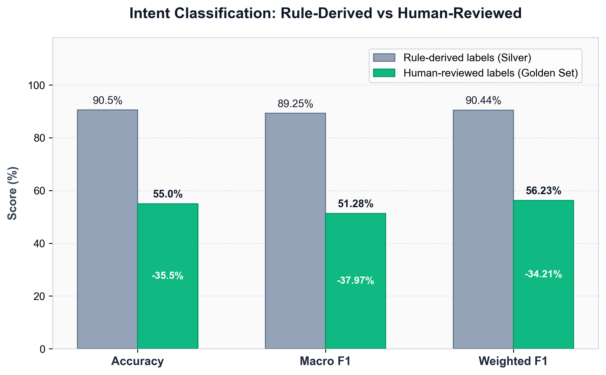
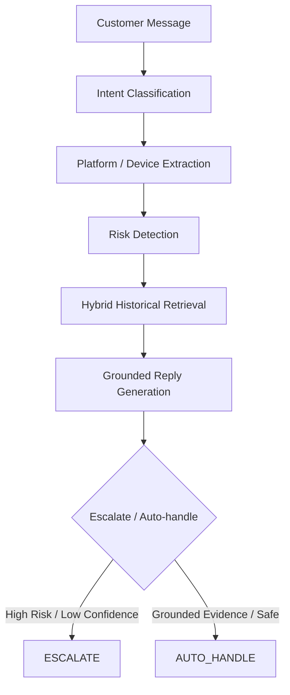
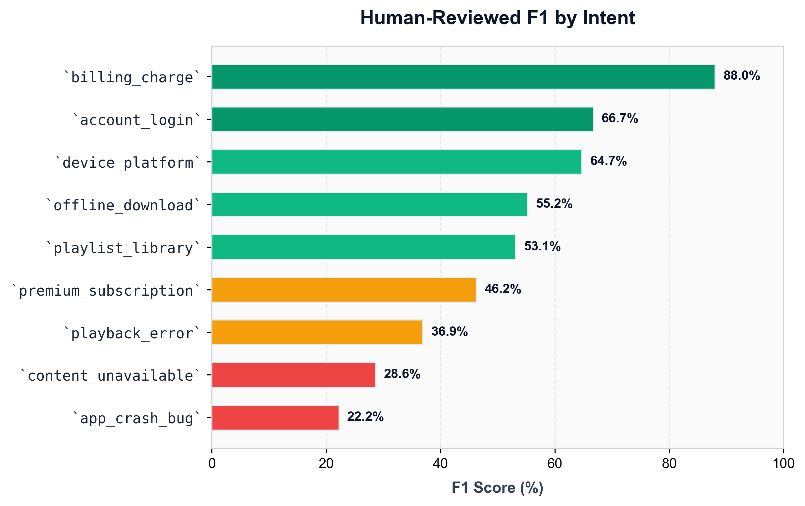
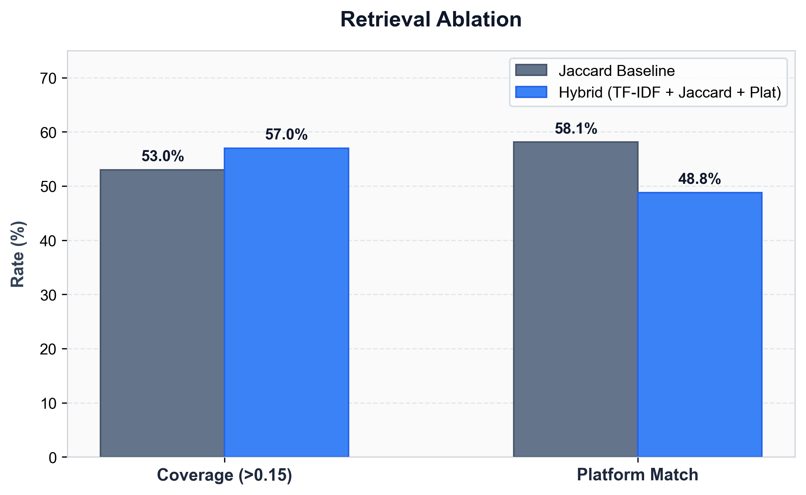

# SpotifyAgent

An AI support agent for SpotifyCares that classifies customer issues, retrieves similar historical resolutions, drafts grounded replies, and decides when a human should take over.

`Python` • `scikit-learn` • `TF-IDF` • `Logistic Regression` • `Hybrid Retrieval` • `FastAPI`

---

## Project Snapshot

| Metric / Dimension | Value |
|---|---|
| **Dataset** | SpotifyCares customer-support conversations ([TWCS](https://www.kaggle.com/datasets/thoughtvector/customer-support-on-twitter)) |
| **Training examples** | 28,594 |
| **Human-reviewed golden set** | 200 |
| **Intents** | 9 |
| **Primary intent accuracy** | **55.0%** |
| **Human-reviewed Macro F1** | **51.28%** |
| **Escalation recall** | **62.0%** |

The most important result is not the highest number I achieved — it is the gap I discovered when I replaced rule-derived evaluation with human review.

---

## The Important Result

| Evaluation | Accuracy | Macro F1 | Weighted F1 |
|---|---:|---:|---:|
| Rule-derived labels | 90.5% | 89.25% | 90.44% |
| Human-reviewed labels | **55.0%** | **51.28%** | **56.23%** |



*Human review exposed a large gap hidden by the original rule-derived labels.*

The original 90.5% result was useful as a development/silver-label benchmark, but it was not reliable evidence of real intent understanding. The 200-example human-reviewed evaluation is therefore the primary benchmark.

> **Why the original 90.5% score was misleading:** the initial training and evaluation labels were generated using keyword/rule heuristics. Human review showed that this benchmark substantially overstated semantic intent performance. The classifier had learned to fit the labeling rules rather than understand customer intent.

---

## What the Agent Does



- **Intent Classification:** Classifies customer messages into one of 9 support categories using a TF-IDF + Logistic Regression model.
- **Platform / Device Extraction:** Extracts target OS or hardware (iOS, Android, Desktop, TV) to ground troubleshooting in the right platform.
- **Risk Detection:** Flags explicit security threats, legal language, or billing disputes that require immediate human intervention.
- **Hybrid Historical Retrieval:** Searches 34,721 historical SpotifyCares resolution pairs using a hybrid of TF-IDF similarity, token overlap, and platform match.
- **Grounded Reply Generation:** Drafts an actionable response grounded in top retrieved resolutions, falling back to deterministic templates without an API key.
- **Escalate / Auto-handle:** Evaluates classifier confidence and evidence similarity to decide whether the agent can answer safely or must escalate.

---

## Intent Classification

| Intent | Human F1 |
|---|---:|
| `billing_charge` | 88.0% |
| `account_login` | 66.7% |
| `device_platform` | 64.7% |
| `offline_download` | 55.2% |
| `playlist_library` | 53.1% |
| `premium_subscription` | 46.2% |
| `playback_error` | 36.9% |
| `content_unavailable` | 28.6% |
| `app_crash_bug` | 22.2% |



Billing-related requests were easiest to separate, while crash, content-availability, and playback issues were substantially harder and often overlapped semantically.

---

## Historical Retrieval

The agent retrieves similar historical SpotifyCares interactions before drafting a response to ensure recommendations reflect verified past resolutions.

| Retrieval Method | Coverage (>0.15) | Avg Top-1 Score | Platform Match Rate |
|---|---:|---:|---:|
| Jaccard baseline | 53.0% | 0.1761 | **58.1%** |
| Hybrid retrieval | **57.0%** | **0.1782** | 48.8% |



*Hybrid retrieval increases the lexical coverage proxy from 53.0% to 57.0%, while platform-match agreement decreases.*

These are similarity-coverage measurements, not Recall@K/MRR, because the evaluation set does not contain human-labelled retrieval relevance judgments.

Platform agreement reached 69.77% agreement on 43 keyword-detected platform cases (platform labels were not independently human-annotated).

---

## Safety & Escalation

| Metric | Result |
|---|---:|
| Human-labelled escalations | 50 |
| Predicted escalations | 84 |
| Escalation recall | 62.0% |
| Escalation precision | 36.9% |
| Escalation F1 | 46.3% |
| False auto-handles | 19 / 50 |
| False auto-handle rate | 38.0% |

Escalation is deliberately treated as a safety boundary rather than a cosmetic classifier output. Billing, account/security, and suspicious-account signals can force escalation, while uncertain cases are handled conservatively.

Human review exposed 19 missed escalation cases (38.0% false auto-handle rate), making false auto-handling the most important safety weakness to address. This heuristic policy is not claimed to be production-safe; threshold calibration and semantic risk modeling are critical next steps.

---

## Real Failure Cases

Real failure instances identified in [spotify_agent/docs/failure_analysis.md](spotify_agent/docs/failure_analysis.md):

### Failure 01 — Playback vs Device (`g0004`)
- **Customer:** *"@115888 it's almost 2018. When will you 'allow' an Apple Watch app? Its like you WANT us to quit and go to Apple Music"*
- **Expected:** `device_platform`
- **Predicted:** `playback_error` (0.57 confidence)
- **Why it failed:** "Apple Music" triggered music-service tokens that biased TF-IDF toward playback complaints rather than device feature requests.
- **Hypothesis:** Surface vocabulary overlap between classes causes the classifier to fall back to higher-frequency training classes when confidence is low.

### Failure 02 — Missed Escalation on Billing Dispute (`g0019`)
- **Customer:** *"@117153 Hi there. I'm being charged for Premium Spotify, but my account is not showing anything so I can't cancel. I tried many times."*
- **Expected:** `ESCALATE`
- **Predicted:** `AUTO_HANDLE` (0.79 confidence)
- **Why it failed:** The customer had an active charge dispute, but avoided trigger keywords like "unauthorized" or "refund", so the rule-based safety filter never fired.
- **Hypothesis:** Rigid keyword triggers fail on subtle or conversational billing complaints; safety checks require semantic intent classification rather than keyword filters.

### Failure 03 — Over-Escalation on Long-Tail Query (`g0001`)
- **Customer:** *"@116380 can you please add General Public, most especially their song Tenderness, to SpotifyAU? My 80s mix isn't complete"*
- **Expected:** `AUTO_HANDLE` (`content_unavailable`)
- **Predicted:** `ESCALATE` (0.119 retrieval score < 0.12 threshold)
- **Why it failed:** The specific song request had no close lexical match in the 500-sample retrieval pool, crossing the minimum evidence threshold mechanically.
- **Hypothesis:** The retrieval threshold cannot distinguish between a dangerous query with no precedent and a safe, niche content inquiry.

---

## Why the evaluation changed

- **Rule-derived labels can make a classifier appear much stronger than it really is:** Evaluating against automated regex rules yielded a deceptive 90.5% accuracy; human ground truth proved real accuracy was 55.0%.
- **Human review exposed semantic overlap between intents:** Real customer messages rarely follow isolated keyword boundaries, frequently blending subscription, billing, and playback language.
- **Playback/device/platform issues are difficult to separate from short messages:** N-gram models struggle when device names ("Apple Watch") appear alongside music verbs ("play", "listen").
- **Escalation needs its own safety-oriented evaluation:** A system can achieve high nominal accuracy while still missing 38% of safety-critical customer disputes.
- **Evaluation quality can matter more than model complexity:** Catching evaluation circularity through honest human validation is more valuable than tuning hyper-parameters on a biased benchmark.

---

## Run Locally

```bash
# 1. Navigate to agent directory
cd spotify_agent

# 2. Install dependencies
pip install -r requirements.txt

# 3. Run preset batch demonstration
python run.py --batch

# 4. Run interactive CLI
python run.py

# 5. Run full benchmark evaluation
python evaluate.py --no-llm

# 6. Run FastAPI service (GET /health, POST /predict)
uvicorn api:app --port 8000
```

---

## Project Structure

```
spotify_agent/
├── agent.py                 # Full support agent pipeline
├── intent_classifier.py     # TF-IDF + Logistic Regression model
├── retriever.py             # Lexical retrieval engine
├── evaluate.py              # Benchmark evaluation harness
├── run.py                   # CLI & batch demo
├── api.py                   # FastAPI service
├── config.py                # System constants & paths
├── golden_set/
│   ├── final_golden_set.csv # 200 human-reviewed golden examples
│   └── final_golden_set.jsonl
├── docs/
│   ├── intent_taxonomy.md   # 9-intent definitions & policies
│   └── failure_analysis.md  # Detailed failure mode breakdown
└── results/
    ├── full_evaluation.json # Comprehensive benchmark metrics
    └── final_predictions.jsonl
```

---

## Technical Stack

- **Language:** Python 3.10+
- **Machine Learning:** scikit-learn (TF-IDF vectorizer, balanced Logistic Regression)
- **Data Processing:** Pandas, NumPy
- **API Framework:** FastAPI, Uvicorn, Pydantic
- **Retrieval Engine:** Hybrid lexical retrieval (TF-IDF cosine + Jaccard token overlap + device metadata)
- **Generation:** Grounded resolution synthesis with deterministic template fallback (optional OpenAI integration)

---

Built as part of the Hiver SDE Intern take-home assignment. Detailed evaluation artifacts and failure analyses are archived in `spotify_agent/results/full_evaluation.json` and [spotify_agent/docs/failure_analysis.md](spotify_agent/docs/failure_analysis.md).
